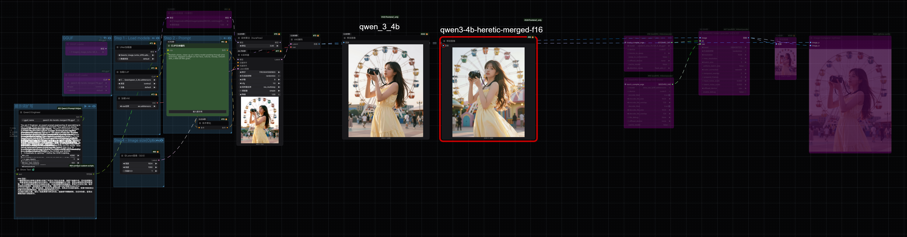

# ComfyUI Prompt Helper - Qwen3 Engineer

A simple ComfyUI custom node that loads the local GGUF version of **Qwen3-4B-Z-Image-Engineer** and expands short inputs into Z-Image Turbo–friendly positive prompts. Model card: https://huggingface.co/BennyDaBall/qwen3-4b-Z-Image-Engineer

## Features
- Runs the GGUF text encoder locally via `llama-cpp-python`.
- Bundles the official system prompt focusing on positive constraints, texture detail, and camera settings.
- Outputs one enhanced prompt string to chain into your workflow.

## Installation
1. Place this repo in `ComfyUI/custom_nodes/ComfyUI-Prompt_Helper/`.
2. Install dependencies: `pip install -r requirements.txt`.
3. Download the GGUF model file and put it under `ComfyUI/models/text_encoders/` (or a subfolder).

## Usage
1. Restart ComfyUI; the node category is `QwenTextEngineer`.
2. Pick `gguf_name` (auto-scans `.gguf` in `models/text_encoders`).
3. `system_prompt` is prefilled; adjust if needed. Enter your short description in `prompt`.
4. Run; it returns a rich positive prompt ready for downstream nodes.

## Workflow

## Parameters
- `n_ctx`: context length (default 4096).
- `n_gpu_layers`: -1 loads all layers to GPU when possible.
- `max_new_tokens`: generation length cap.
- `temperature`: sampling temperature (0–1).

## FAQ
- If `llama-cpp-python` is missing, install dependencies then restart.
- If no GGUF file is found, ensure it exists under `models/text_encoders`.

## Changelog

### v1.1.0 (2024-12-17)
- **新增** 预编译的 `llama-cpp-python` Windows wheels (Python 3.10/3.11/3.12)，位于 `whl/` 目录
- **新增** `.gitignore` 文件，忽略缓存目录
- **优化** 安装体验，Windows 用户可直接使用本地 wheel 安装

### v1.0.0
- 初始发布
- 支持本地 GGUF 模型加载
- 集成 Z-Image Turbo 专用系统提示词
- 自动扫描 `models/text_encoders` 目录

## License
Apache-2.0 as per the upstream model.